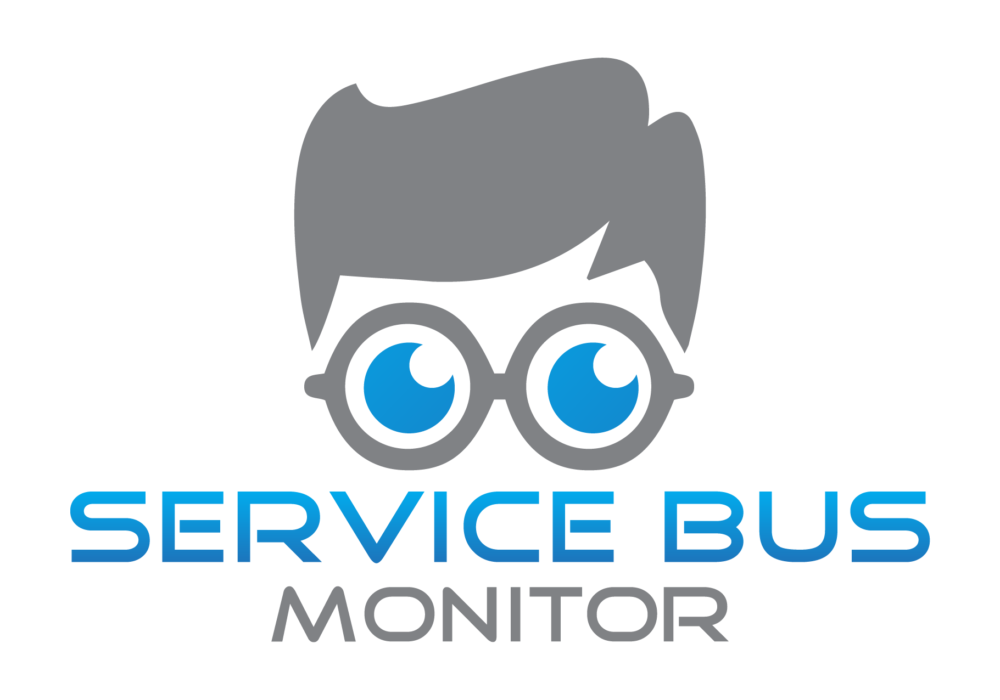
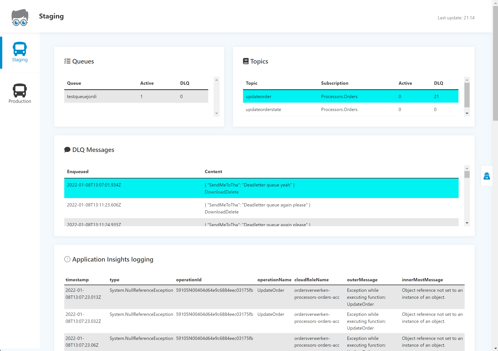

# Service Bus Monitor for the Azure Service Bus
Operational Monitor for an Azure Service Bus.
The application lists the topics and queues on an Azure Service Bus, and gives you the following options
on the deadlettered messages:
* List
* Download
* Remove a specific message
* Resubmit a specific message
* Try to find Application Insights logs (exceptions)

# So, how does it look?

# To do
The following steps:
* When deleting/resubmitting a message from a topic or queue, reload the DLQ message count
* When there are no topics, queues, messages or AI logs, show a message
* Code cleanup/refactoring
* Unit tests
* View messages without having to download
* Add an explanation on how to use the Operation Id in Application Inisghts
* Clean up the CSS file
* Show headers in log files
* Run in Docker

And somewhere in the future, maybe:
* Migrate to a static Web App
